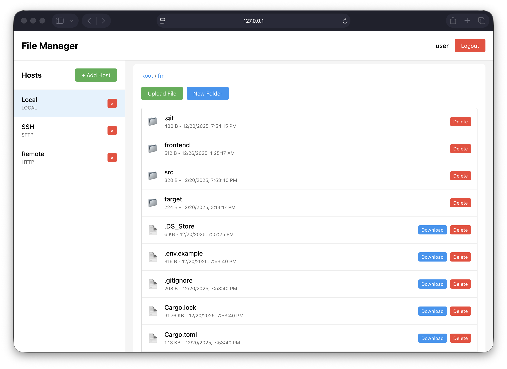

# File Manager

A modern file manager with a single-binary Rust server (actix-web) serving an embedded Vue 3 SPA.



## Features

- **User Authentication**: JWT-based authentication system
- **Multiple Host Types**: 
  - Local Filesystem
  - HTTP (read-only)
  - SFTP
- **File Operations**: Browse, upload, download, delete files and create directories
- **Real-time Updates**: WebSocket support for live events
- **Security**: Encrypted credential storage using ring
- **Metrics**: Prometheus metrics endpoint
- **Single Binary**: Frontend assets embedded in the binary

## Prerequisites

- Rust 1.70+
- Node.js 18+
- SQLite (file-based via sqlx)

## Quick Start

### 1. Initialize SQLite

```bash
# No external DB server required — the application uses a file-based SQLite database by default.
# Optional: install sqlite3 client for manual inspection (example for macOS/Homebrew):
#   brew install sqlite

# Optionally set the database file (sqlite URI), e.g.:
export DATABASE_URL="sqlite://./fm.db"
```

### 2. Build the Application

```bash
./build.sh
```

This will:
- Install frontend dependencies
- Build the Vue 3 frontend
- Build the Rust backend with embedded assets

### 3. Run the Server

```bash
# Set environment variables (optional)
export DATABASE_URL=sqlite://./fm.db
export JWT_SECRET=your-secret-key
export ENCRYPTION_KEY=your-32-byte-encryption-key
export HOST=127.0.0.1
export PORT=8080

# Run the server
./target/release/fm
```

Or run directly with environment variables:

```bash
DATABASE_URL=sqlite://./fm.db JWT_SECRET=my-secret ./target/release/fm
```

### 4. Access the Application

Open your browser and navigate to:
```
http://localhost:8080
```

## Development

### Frontend Development

```bash
cd frontend
bun install
bun run dev
```

The frontend will be available at `http://localhost:3000` with API proxy to the backend.

### Backend Development

```bash
cargo run
```

## API Endpoints

### Authentication
- `POST /api/auth/register` - Register new user
- `POST /api/auth/login` - Login user

### Hosts
- `POST /api/hosts` - Create new host
- `GET /api/hosts` - List user's hosts
- `GET /api/hosts/:id` - Get host details
- `DELETE /api/hosts/:id` - Delete host

### Files
- `POST /api/files/browse` - Browse files in a host
- `POST /api/files/download` - Download a file
- `POST /api/files/upload` - Upload a file
- `POST /api/files/delete` - Delete a file
- `POST /api/files/mkdir` - Create directory

### Other
- `GET /metrics` - Prometheus metrics
- `WS /ws` - WebSocket connection

## Configuration

Environment variables:

- `DATABASE_URL` - SQLite connection URL (file-based). Default: `sqlite://fm.db` (set this to point at a different file if desired)
- `JWT_SECRET` - Secret key for JWT tokens (default: `your-secret-key`)
- `ENCRYPTION_KEY` - 32-byte key for encrypting credentials (default: `default-32-byte-encryption-key!`)
- `HOST` - Server host (default: `127.0.0.1`)
- `PORT` - Server port (default: `8080`)

## Architecture

### Backend Stack
- **actix-web**: Web framework
- **tokio**: Async runtime
- **SQLite (sqlx)**: Database (file-based, persistent)
- **jsonwebtoken**: JWT authentication
- **ring**: Credential encryption
- **ssh2**: SFTP support
- **reqwest**: HTTP client
- **prometheus**: Metrics
- **rust-embed**: Static asset embedding

### Frontend Stack
- **Vue 3**: UI framework
- **TypeScript**: Type safety
- **Vite**: Build tool
- **Pinia**: State management
- **Axios**: HTTP client

## Security

- Passwords are hashed using bcrypt
- Credentials (SFTP passwords) are encrypted using AES-256-GCM
- JWT tokens for API authentication
- Path traversal protection for local filesystem access

## Building for Production

The release build is optimized for size and performance:

```bash
./build.sh
```

The resulting binary is:
- Statically linked where possible
- Stripped of debug symbols
- Contains embedded frontend assets
- Single file deployment

## Metrics

Prometheus metrics are available at `/metrics`:

- `http_requests_total` - Total HTTP requests
- `http_request_duration_seconds` - Request duration
- `file_uploads_total` - Total file uploads
- `file_downloads_total` - Total file downloads

## License

MIT
